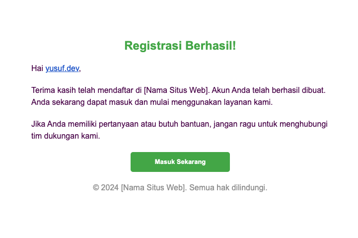
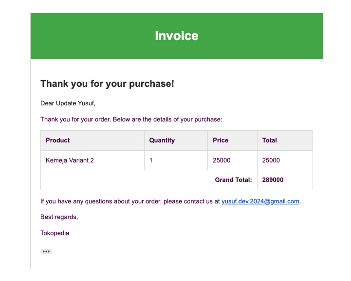

# Final Project Yusuf Setiyawan BE 58

## URL Deploy

The project is currently deployed and available online. You can access the live application at :

```bash
https://sanber-be-58-final-project-yusuf-production.up.railway.app/
```

## Endpoints Documentation

**Base URL**

```bash
https://sanber-be-58-final-project-yusuf-production.up.railway.app/api
```

**Request Headers**

```bash
Authorization: Bearer <your-jwt-token>
```

## Health check

#### 1. **Create Order**

- **Endpoint:** `/`
- **Method:** `GET`
- **Request Body:**

## Auth

#### 1. **Register**

- **Endpoint:** `/auth/register`
- **Method:** `POST`
- **Request Body:**

```bash
{
  "email": "yusuf.dev.2024@gmail.com",
  "fullName": "Yusuf Dev",
  "password": "12341234",
  "username": "yusuf.dev",
  "roles": ["admin"]
}
```

- **Email receipt**
  

#### 2. **Login**

- **Endpoint:** `/auth/login`
- **Method:** `POST`
- **Request Body:**

```bash
{
  "email": "yusuf.dev.2024@gmail.com",
  "password": "12341234"
}
```

#### 3. **Get Profile**

- **Endpoint:** `/auth/me`
- **Method:** `GET`
- **Request Headers:**
  - `Authorization: Bearer <your-jwt-token>`

#### 4. **Update Profile**

- **Endpoint:** `/auth/profile`
- **Method:** `PUT`
- **Request Headers:**
  - `Authorization: Bearer <your-jwt-token>`
- **Request Body:**

```bash
{
    "fullName":  "Update Yusuf",
    "password": "admin123"
}
```

## Products

#### 1. **Get All Products**

- **Endpoint:** `/products`
- **Method:** `GET`

#### 2. **Create Product**

- **Endpoint:** `/products`
- **Method:** `POST`
- **Request Body:**

```bash
{
    "name": "Kemeja dengan Kategori",
    "description": "Deskripsi kemeja dengan kategori",
    "images": ["https://res.cloudinary.com/five-code/image/upload/v1718805645/fxuurm45mt5talry7a29.png", "sepatu2.jpg", "sepatu3.jpg"],
    "price": 15000,
    "qty": 100,
    "category": "66a260cd6ceb26325b62fcef"
}
```

#### 3. **Get Product by ID**

- **Endpoint:** `/products/:id`
- **Method:** `GET`
- **URL Parameters:**
  - `id` (required): The ID of the product.

#### 4. **Update Product**

- **Endpoint:** `/products/:id`
- **Method:** `PUT`
- **URL Parameters:**
  - `id` (required): The ID of the product.
- **Request Body:**

```bash
{
    "name": "Update"
}
```

#### 5. **Delete Product**

- **Endpoint:** `/products/:id`
- **Method:** `DELETE`
- **URL Parameters:**
  - `id` (required): The ID of the product.

## Categories

#### 1. **Get All Categories**

- **Endpoint:** `/categories`
- **Method:** `GET`

#### 2. **Create Categories**

- **Endpoint:** `/categories`
- **Method:** `POST`
- **Request Body:**

```bash
{
"name":  "Test"
}
```

#### 3. **Get Categories by ID**

- **Endpoint:** `/categories/:id`
- **Method:** `GET`
- **URL Parameters:**
  - `id` (required): The ID of the .

#### 4. **Update Categories **

- **Endpoint:** `/categories/:id`
- **Method:** `PUT`
- **URL Parameters:**
  - `id` (required): The ID of the .
- **Request Body:**

```bash
{
"name":  "update"
}
```

#### 5. **Delete Categories **

- **Endpoint:** `/categories/:id`
- **Method:** `DELETE`
- **URL Parameters:**
  - `id` (required): The ID of the .

## Media Upload

#### 1. **Post Single File**

- **Endpoint:** `/upload`
- **Method:** `POST`
- **Request Body:**
  **_Form Data_**

```bash
{
  "file": "image.png"
}
```

#### 2. **Post Multiple Files**

- **Endpoint:** `/uploads`
- **Method:** `POST`
- **Request Body:**
  **_Form Data_**

```bash
{
  "files": "image1.png",
  "files": "image2.png"
}
```

## Order

#### 1. **Create Order**

- **Endpoint:** `/orders`
- **Method:** `POST`
- **Request Body:**

```bash
{
  "grandTotal": 289000,
  "orderItems": [
    {
      "productId": "66a89e3fccb68bdd5ff7603b",
      "quantity": 1
    }
  ],
   "status": "pending"
}
```

- **Email receipt**
  

#### 2. **List Order**

- **Endpoint:** `/orders`
- **Method:** `GET`
